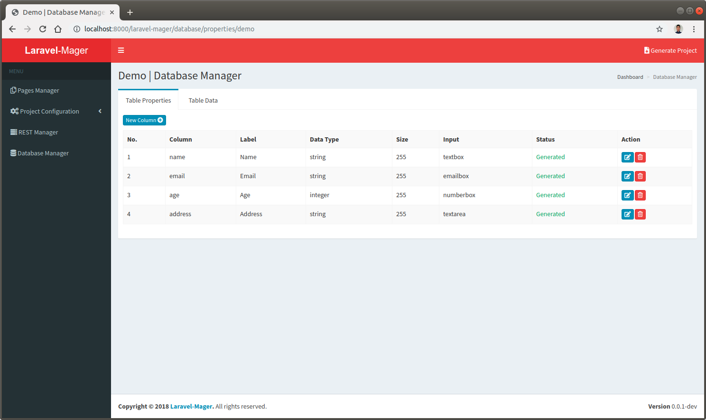
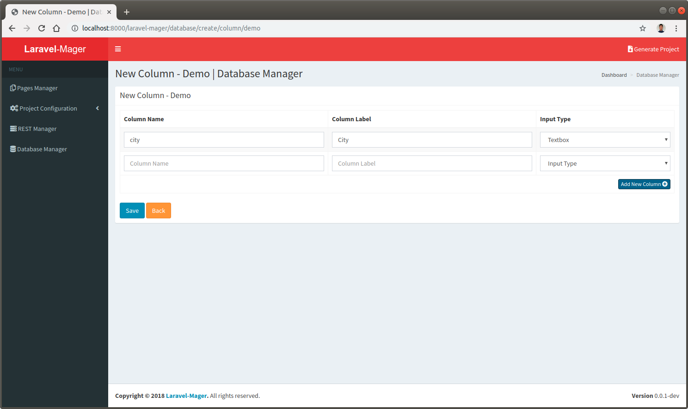

# Table Properties
This feature user for manage database table column based from [`Pages Manager`](_features/pages_manager/page.md) when designing a page layout using [`GUI Builder`](_features/pages_manager/gui_builder.md).

## Column List
This feature will be displaying table column list that created when designing a page layout using [`GUI Builder`](_features/pages_manager/gui_builder.md). 

 
 
## Create and Edit Column
This feature will provides a form for create and edit database column.
There are three input in this form that described below:

No. | Input | Description
--- | --- | ---
1. | **Column Name** | Database column name
2. | **Column Label** | The text that will be displayed in form or page user as the name of the table column
3. | **Input Type** | Type of the HTML form input for the table column

 
