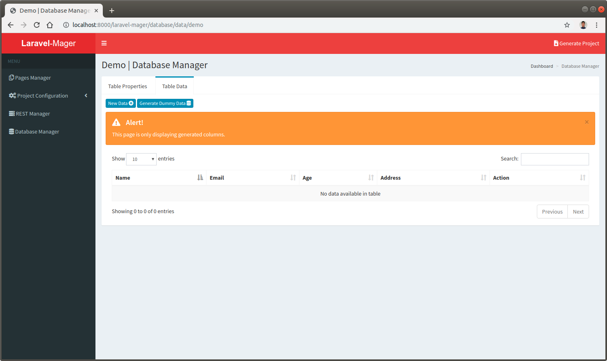
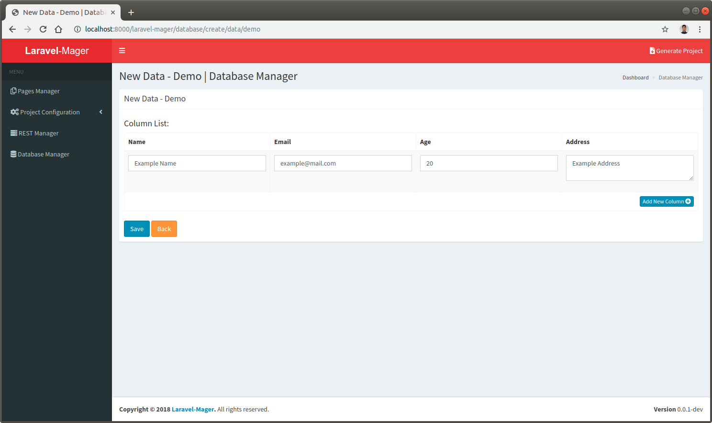
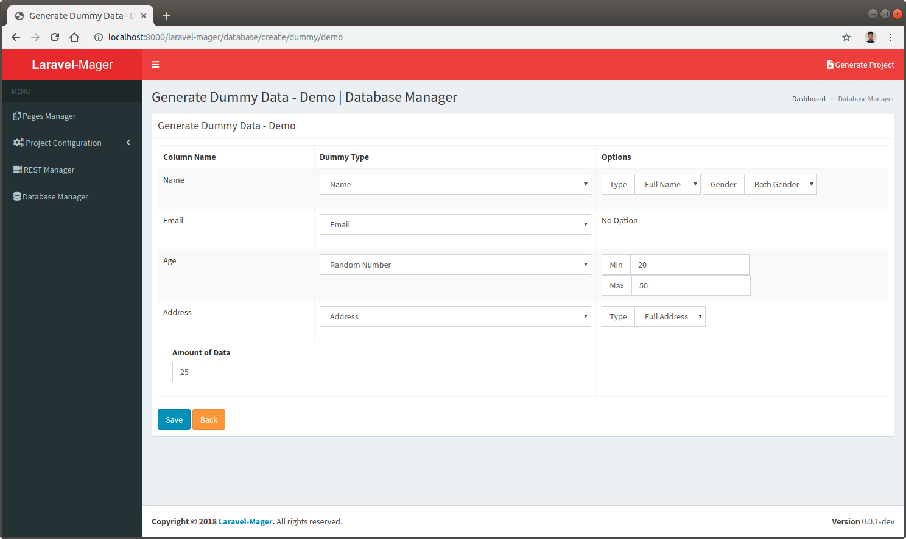
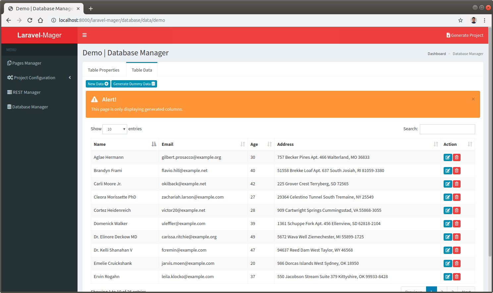

# Table Data
This feature user for manage database table data and generate dummy data.

## Data List
This feature will be displaying table data list, but only for columns that already generated. 

 
 
## Create and Edit Data
This feature will provides a form for create and edit single data.
Inputs of this form is based from the last generated columns.
The input type also follows the input type when designed using [`GUI Builder`](_features/pages_manager/gui_builder.md).

 
 
## Create dummy data
This feature similar with create data, but this feature can produces many dummy data automatically using `Faker` dependency.
This feature provides a form to choose what kind of dummy data for each generated column and also define how many the amount of the dummy data that will be produced. 

 
 
 
