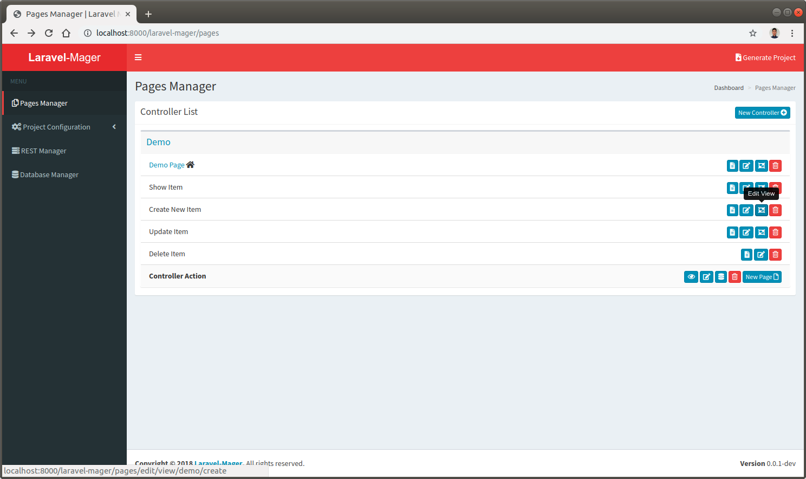
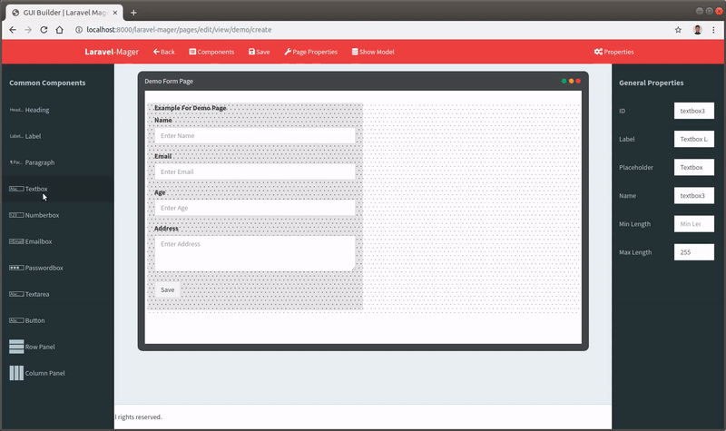
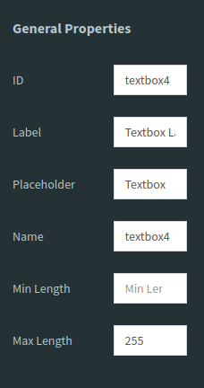
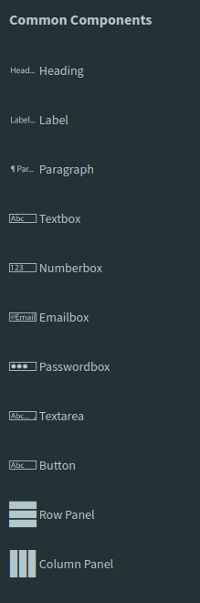
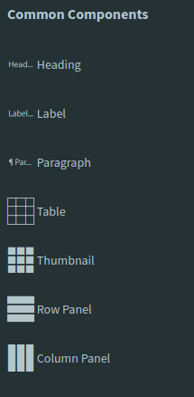
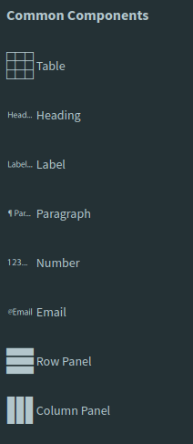

# GUI Builder

## Using GUI Builder

### Click `Edit View` Button
 

### Drag and Drop
 Drag HTML component from common component box and drop in the drawing panel
 
 
 
### Edit the properties
 Use the properties box to set the HTML components properties and attributes. 
 Each HTML component have different properties panel. 
 The property Name will be generated as database table column name.
 
 
 
## GUI Builder Variations
There are three kinds of GUI Builder, each have different HTML Component list for drag and drop.

### GUI Builder for Form
 This GUI Builder is used for designing form layout for create and edit page.
 
 

### GUI Builder for Index Page
 This variant of GUI Builder is used for designing index page layout. 
 Index page is the page for displaying all database table item list. 
 
 

### GUI Builder for Detail Page
 This variant of GUI Builder is used for designing detail page layout. 
 Detail page is the page for displaying single database table item detail. 
 
 