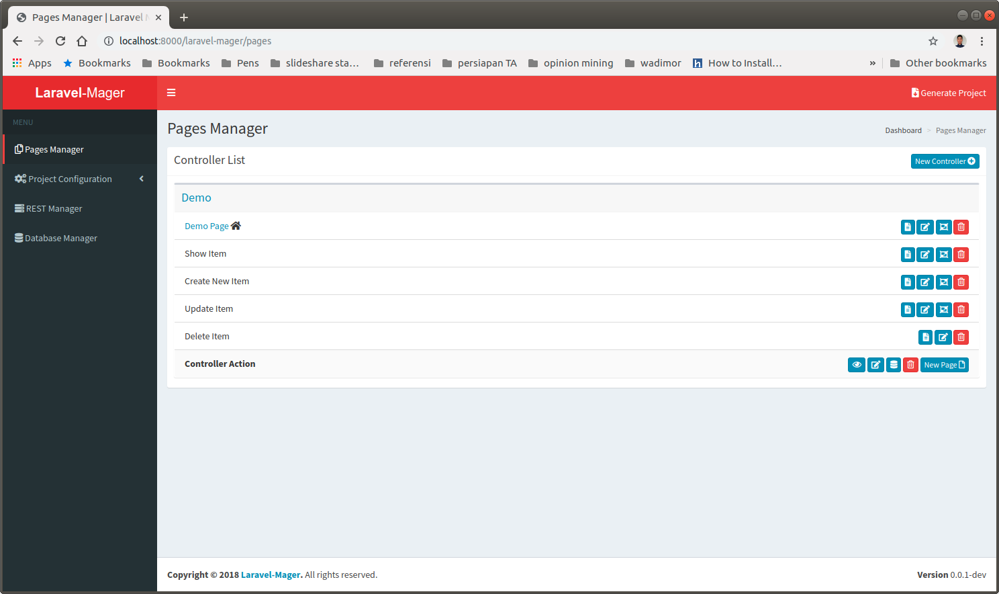

# Introduction

## Pages Manager

 
 
`Pages Manager` is a feature for managing controllers pages. 
It can create controllers and its pages based from `Laravel Resource Controller` that using index, show, create, store, edit, update, and destroy methods for provides CRUD operations.
Using the `GUI Builder`, a view page can be easily designed without write any code.  

## Features
* [Controller Management](_features/pages_manager/controller.md)
* [Page Management](_features/pages_manager/page.md)
* [GUI Builder](_features/pages_manager/gui_builder.md)