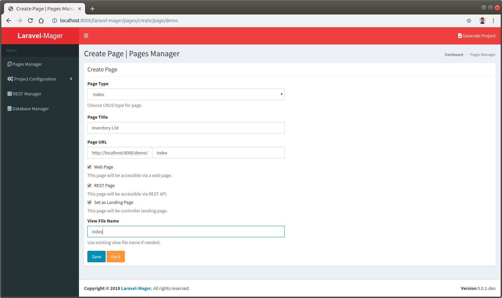
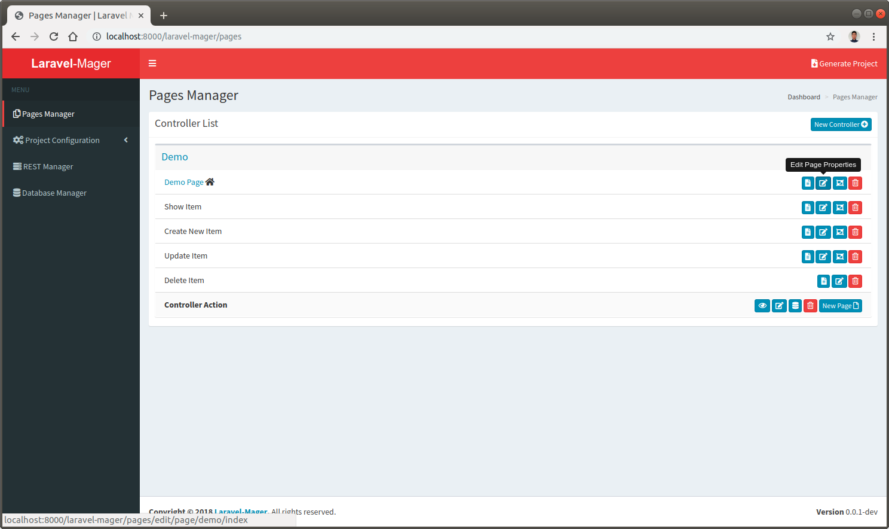
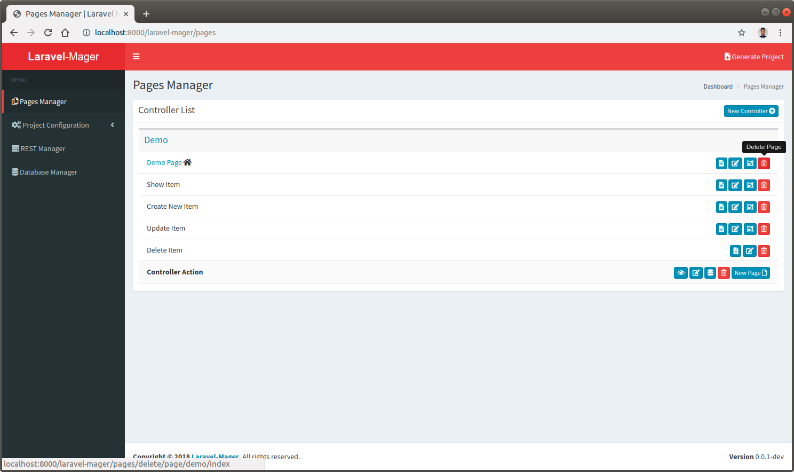

# Page Management

## Create New Page

### Click `new page` button
 
 
### Fill the `create new` form
The example for create inventory list page that will show the inventory items list with the following scenarios:

No. | Input | Example | Description
--- | --- | --- | ---
1. | **Page Type** | index | Page type based on Laravel resource controller (index, show, create, edit, destroy)
2. | **Page Title** | Inventory List | The page title that will be shown in the browser's title bar and will be shown as page heading
4. | **Page URL** | index | The URL / link to access the page using browser / REST API
6. | **Web Page** | checked | Page availability to be accessed via web browser
7. | **REST Page** | checked | Page availability to be accessed via REST API
8. | **Set as Landing Page** | checked | Only available if Page Type Index selected, used to make the following page to be landing page
9. | **View File Name** | index | The file name for the page's blade template

 

## Edit Existing Page
Every Page will have edit page button, so click the edit button on the desired page and it will be open the edit form

 

## Delete Page

Use `Delete Page` button to delete the desired page properties.

 
