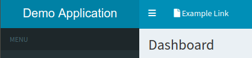
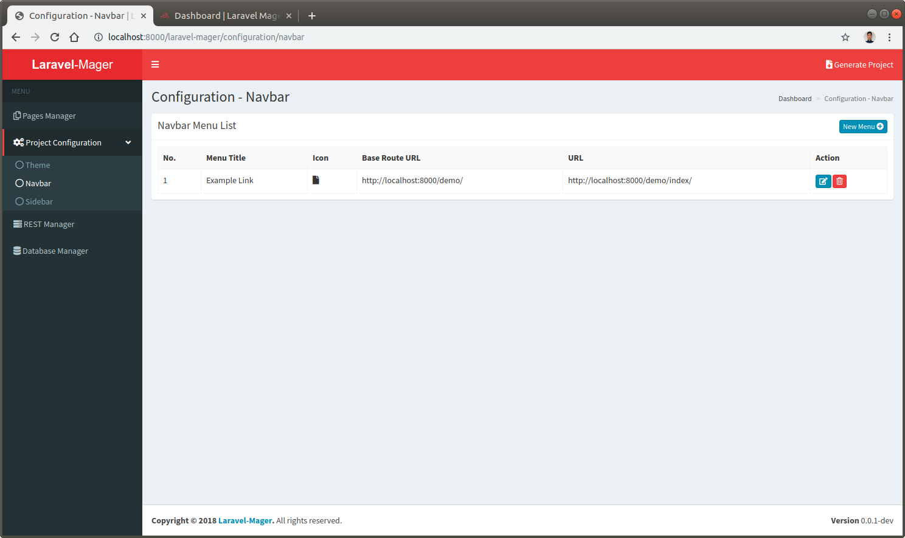
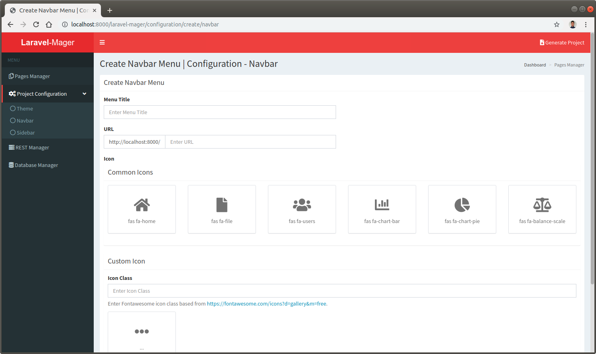

# Navbar
Navbar feature used to manage links in the navbar layout.

 

## Navbar List

 

## Create and Edit Navbar

 
 
Navbar link style will be an icon followed by a HTML link, so the create and edit form will provides following inputs:

No. | Input | Description
--- | --- | ---
1. | **Menu Title** | The text of the link that will be displayed
2. | **URL** | The url of the destination page
3. | **Icon (Common Icons)** | 6 commonly used icon based on [`fontawesome`](https://fontawesome.com/icons?d=gallery&m=free) free icons
4. | **Icon (Custom Icons)** | Will be used if desired icon not available in Common Icons, fill using desired [`fontawesome`](https://fontawesome.com/icons?d=gallery&m=free) icon class