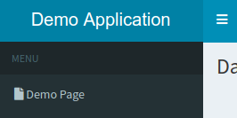
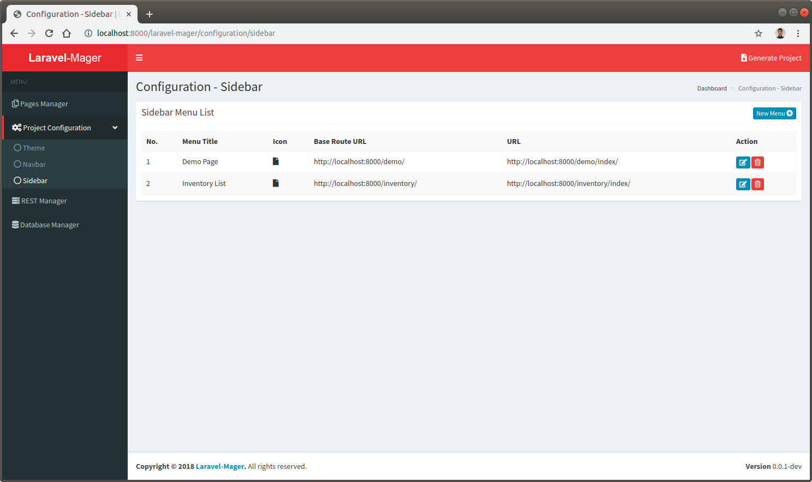
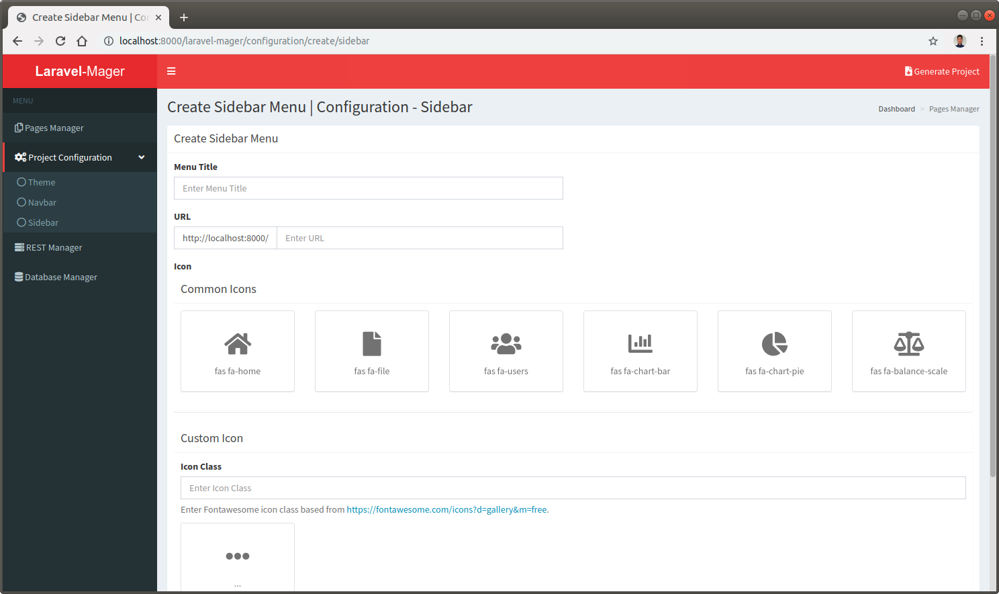

# Sidebar
Same as the navbar, sidebar feature used to manage links in the sidebar layout.

 

## Sidebar List
By default a link will be added when an index page with `set as landing page` option checked created in [`Pages Manager`](_features/pages_manager/page.md).
 

## Create and Edit Sidebar

 
 
Also same as the navbar, the link style will be a `fontawesome` icon followed by a HTML link, so the create and edit form will provides following inputs:

No. | Input | Description
--- | --- | ---
1. | **Menu Title** | The text of the link that will be displayed
2. | **URL** | The url of the destination page
3. | **Icon (Common Icons)** | 6 commonly used icon based on [`fontawesome`](https://fontawesome.com/icons?d=gallery&m=free) free icons
4. | **Icon (Custom Icons)** | Will be used if desired icon not available in Common Icons, fill using desired [`fontawesome`](https://fontawesome.com/icons?d=gallery&m=free) icon class