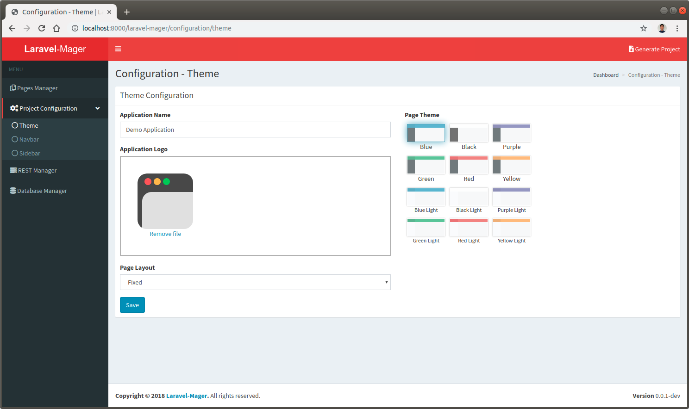

# Theme

 
 
Theme configuration is a feature for configure global application theme layout, such us application name, logo, page layout, and page theme.
Page layout and page theme configuration based on AdminLTE page layout and page theme style. 