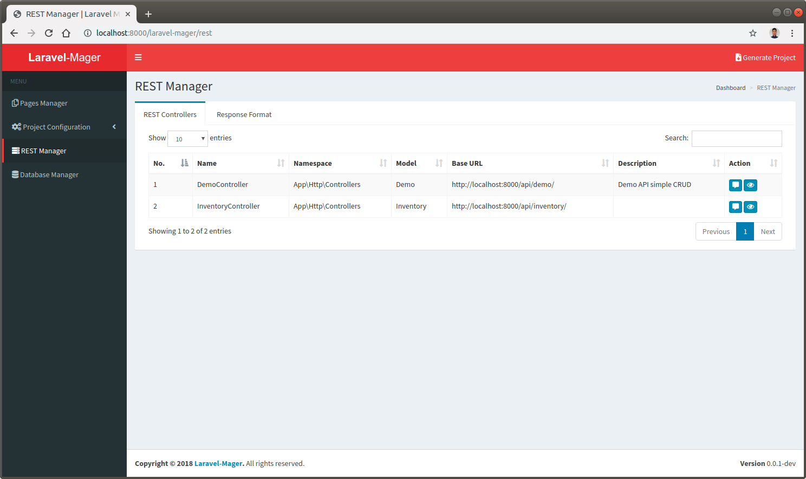

# Introduction

## REST Manager

 
 
`REST Manager` is a feature for decide how the REST API JSON response will be and also create REST API Documentation using `Swagger UI`.  

## Features
* [REST API Description](_features/rest_manager/rest_api_description.md)
* [JSON Format](_features/rest_api_description/json_format.md)
* [Generate](_features/rest_api_description/generate.md)
