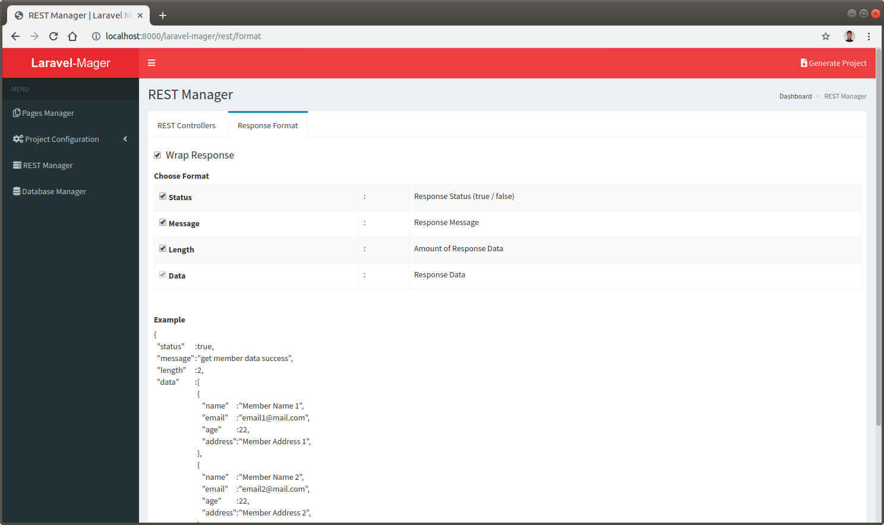
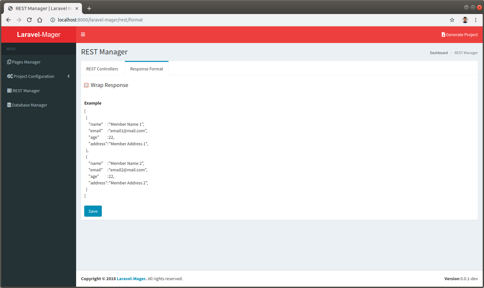

# JSON Format
This feature used for decide what kind of JSON response format will be used. 
There are two kinds of the response format, these are wrapped and unwrapped.

## Wrapped JSON Response
Wrapped JSON response is the response format that wrapping the response data by some additional attributes.
The additional attributes that can be included are `Status`, `Message`, `Length`, and `Data`. 
By default the Data attribute should be selected. 
The additional attributes are described below:

No. | Attribute | Description
--- | --- | ---
1. | **Status** | Response Status (true / false)
2. | **Message** | Response Message
3. | **Length** | Amount of Response Data
4. | **Data** | The Response Data from database operation

 
 
## Unwrapped JSON Response
Unwrapped JSON response is response format that deliver the plain response data immediately without additional headers.

 
 
