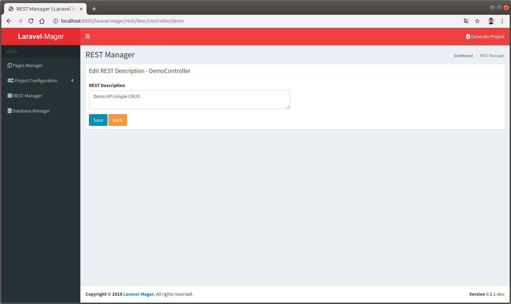
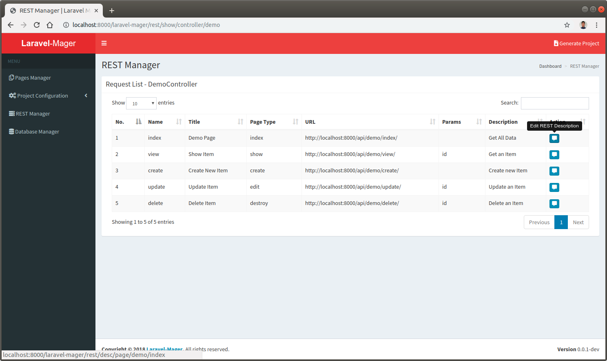

# REST API Description
This feature used for create REST API documentation using `Swagger UI`.
Description used for describe usage of the controllers and pages and will be displayed in `Swagger UI` documentation.

## Controller List
This feature will be displaying controller list configured as `REST Controller` when created using [`Pages Manager`](_features/pages_manager/controller.md).

  
 
## Edit Controller Description
By default, each controller has no description, so edit the description by clicking `Edit REST Description` button, 
then REST Description form will be appeared. Only fill the description in the REST Description input and save it.

 

## Page Request List
Similar as the `Controller List`, it will displaying `REST Page` configured pages for selected controller.

 

## Edit Page Request Description
Same as `Edit Controller Description`, edit the description by clicking `Edit REST Description` button, and fill the REST Description input.

 
