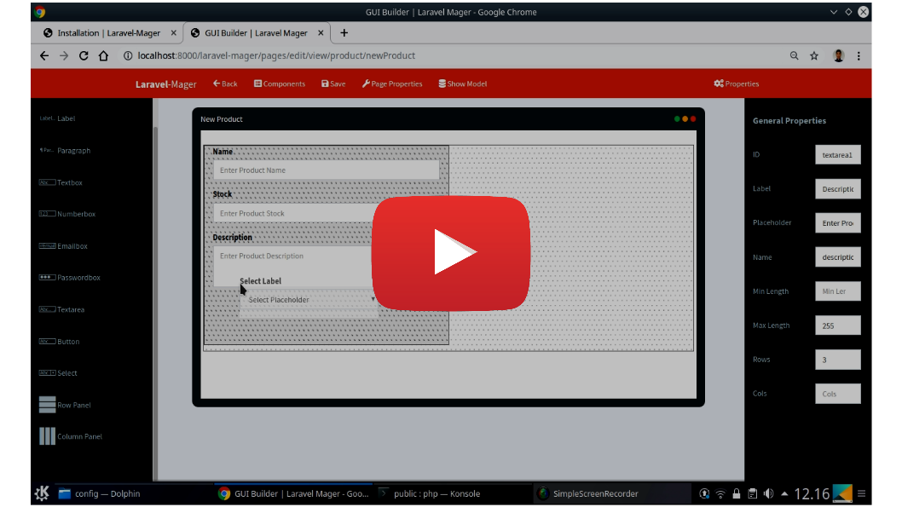
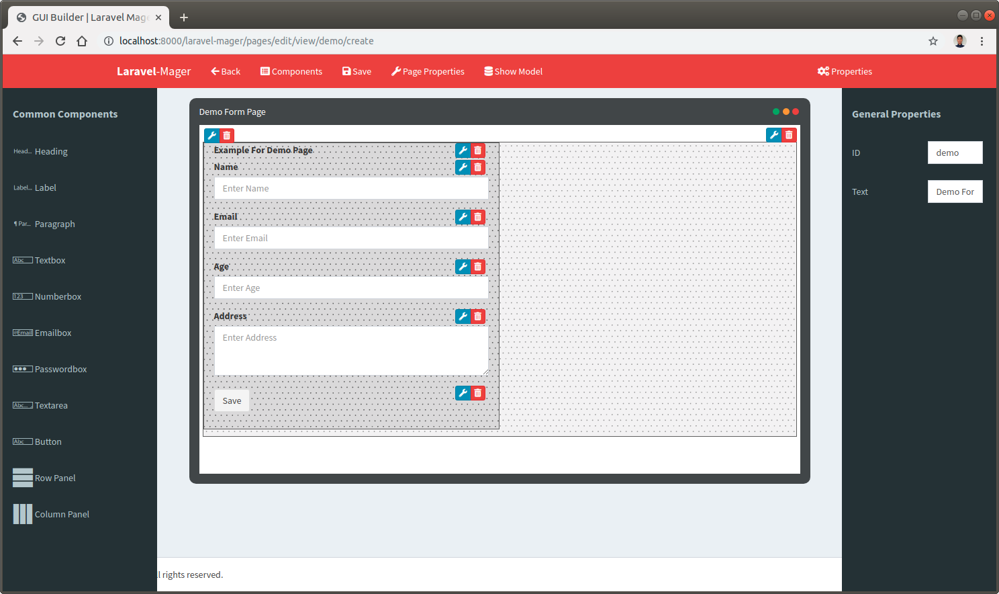
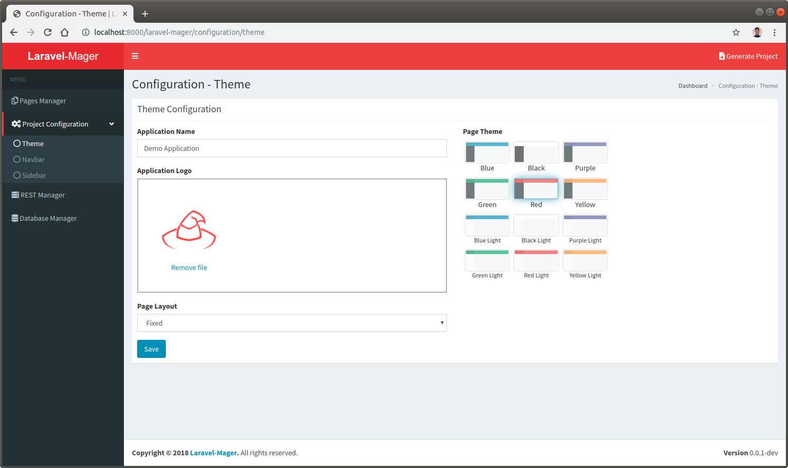
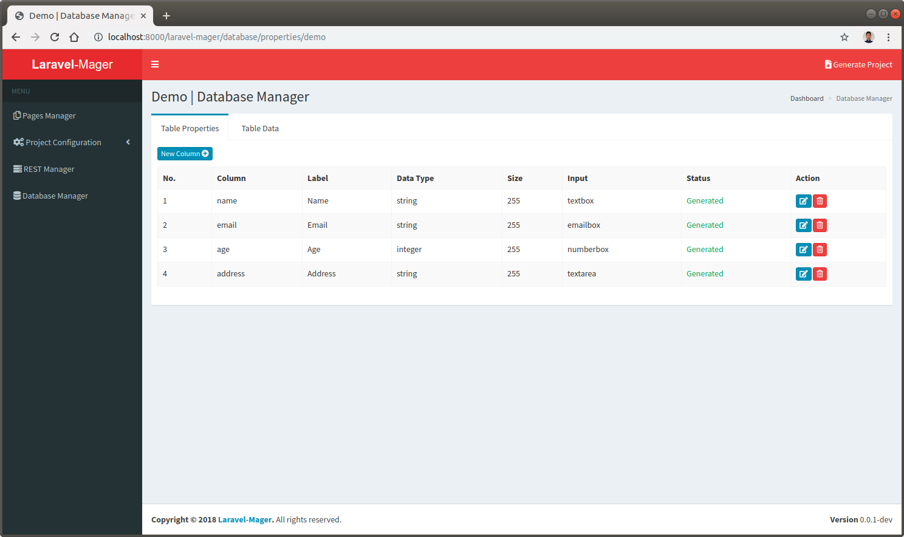

 <!-- introduction.md -->
 
 # Laravel-Mager
 
 Laravel package for design and generate a ready to use application. **Laravel-Mager** provides some features to generate Laravel framework codes without writing any code. The features are:
 
 ")
 
 ## Pages Manager
 Pages Manager provides drag and drop GUI Builder similar to common IDE like Visual Studio and Netbeans. You don't need to write `blade` view files, just design a layout by drag and drop html component in GUI Builder.
 
 
 
 ## Project Configuration
 Choose theme, add application icon, and manage menu list can be managed easily using Project Configuration. You don't need to create a `blade` theme layout anymore.
 
 
 
 ## REST Manager
 REST Manager provides options for designing REST API JSON response format, you can wrap or not the response. This feature will automatically generate the `Eloquent` API Resource and Collection.
 
 
 
 ## Database Manager
 Database Manager will substitute common database manager application like PHPMyAdmin or Adminer. It will produce `Eloquent` model, model factory, seeder, and migration. You also can generate dummy data automatically using `faker` dependency without writing any code.
 
 
 
 # Development
 **`Laravel-Mager is still under development`** as a prototype for student final project at PENS (Politeknik Elektronika Negeri Surabaya). 
 Finished features only handle basic CRUD operation for independent database table without any relation also without validation.
 GUI Builder also only provides some simple html and form components such as textbox, numberbox, emailbox, passwordbox, textarea, heading, data table, and simple thumbnail view.
 Laravel-Mager is using AdminLTE for layout view and can be easily customized. 
